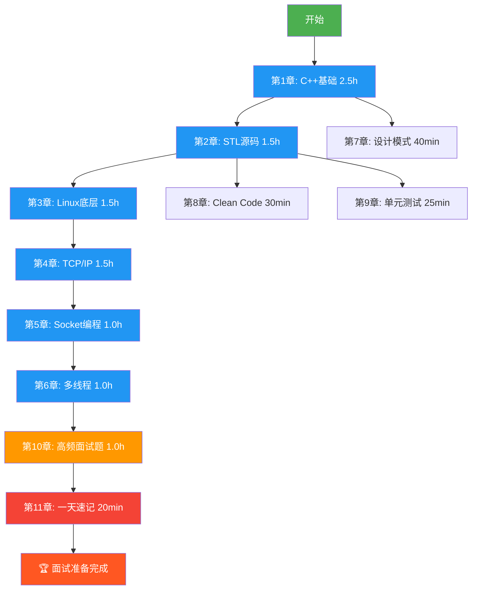

# 🎯 C++ 后端开发面试突击宝典

> **目标岗位**：C++ 后端开发工程师（3~5年经验）
> **学习周期**：1天（约10-12小时高效学习）
> **文档特点**：面试冲刺导向，重点突出，层次清晰，全部代码可编译运行

---

## 📚 目录总览

| 章节 | 文件 | 重要度 | 建议时长 | 累计时长 |
|------|------|--------|----------|----------|
| 总目录 | [README.md](README.md) | — | 5min | 5min |
| 第1章 C++基础 | [01_CPP基础.md](01_CPP基础.md) | ★★★★★ | 2.5h | 2h35min |
| 第2章 STL源码思想 | [02_STL源码.md](02_STL源码.md) | ★★★★★ | 1.5h | 4h5min |
| 第3章 Linux底层 | [03_Linux底层.md](03_Linux底层.md) | ★★★★★ | 1.5h | 5h35min |
| 第4章 TCP/IP | [04_TCP_IP.md](04_TCP_IP.md) | ★★★★★ | 1.5h | 7h5min |
| 第5章 Socket编程 | [05_Socket编程.md](05_Socket编程.md) | ★★★★★ | 1.0h | 8h5min |
| 第6章 多线程 | [06_多线程.md](06_多线程.md) | ★★★★★ | 1.0h | 9h5min |
| 第7章 设计模式 | [07_设计模式.md](07_设计模式.md) | ★★★★ | 40min | 9h45min |
| 第8章 Clean Code | [08_CleanCode.md](08_CleanCode.md) | ★★★★ | 30min | 10h15min |
| 第9章 单元测试 | [09_单元测试.md](09_单元测试.md) | ★★★ | 25min | 10h40min |
| 第10章 高频面试题 | [10_高频面试题.md](10_高频面试题.md) | ★★★★★ | 1.0h | 11h40min |
| 第11章 一天速记 | [11_一天速记.md](11_一天速记.md) | ★★★★★ | 20min | 12h |

---

## 🗺️ 学习路线图



---

## 🔗 章节依赖关系

```
第1章 C++基础 ────────┬──→ 第2章 STL源码
                      ├──→ 第6章 多线程
                      ├──→ 第7章 设计模式
                      ├──→ 第8章 Clean Code
                      └──→ 第9章 单元测试

第2章 STL源码 ────────┘

第3章 Linux底层 ──────┬──→ 第4章 TCP/IP
                      └──→ 第5章 Socket编程

第4章 TCP/IP ─────────┘

第5章 Socket编程 ─────┬──→ 第6章 多线程
                      └──→ 第10章 高频面试题

第6章 多线程 ─────────┘

第7-9章可穿插学习 ────┴──→ 第10章 高频面试题 → 第11章 一天速记
```

**说明**：
- 第1章是基础，必须先学
- 第3→4→5章形成 Linux → 网络 → Socket 的递进链
- 第7/8/9章可以在第1/2章学完后穿插学习
- 第10章综合所有知识点
- 第11章是面试前30分钟速览

---

## ⏱️ 一天冲刺时间表

| 时段 | 时间 | 内容 | 备注 |
|------|------|------|------|
| 🌅 早晨 | 07:00-08:00 | 第1章 C++基础（上） | auto/decltype/nullptr/using/constexpr/lambda |
| 🌅 早晨 | 08:00-09:30 | 第1章 C++基础（下） | move/完美转发/RAII/智能指针/模板/多线程基础 |
| ☀️ 上午 | 09:30-10:00 | 第7章 设计模式 | 单例/工厂/观察者/策略/责任链 |
| ☀️ 上午 | 10:00-11:30 | 第2章 STL源码 | vector/list/deque/map/unordered_map/对比表 |
| 🍜 午休 | 11:30-12:30 | 午饭 + 休息 | 让大脑消化 |
| 🌤️ 下午 | 12:30-14:00 | 第3章 Linux底层 | 进程/线程/内存/文件系统/VFS/系统调用 |
| 🌤️ 下午 | 14:00-15:30 | 第4章 TCP/IP | 三次握手/四次挥手/滑动窗口/拥塞控制 |
| 🌤️ 下午 | 15:30-16:30 | 第5章 Socket编程 | select/poll/epoll/Reactor/完整代码 |
| ⛅ 傍晚 | 16:30-17:30 | 第6章 多线程 | 互斥/死锁/atomic/线程池/生产者消费者 |
| ⛅ 傍晚 | 17:30-18:00 | 第8/9章 | Clean Code + 单元测试 |
| 🌙 晚上 | 18:00-19:00 | 晚饭 | 休息 |
| 🌙 晚上 | 19:00-20:00 | 第10章 高频面试题 | 逐题过，不会的做标记 |
| 🌙 晚上 | 20:00-20:20 | 第11章 一天速记 | 快速过一遍核心要点 |
| 🌙 晚上 | 20:20-22:00 | 查漏补缺 | 回头看标记的薄弱点 |
| 😴 睡前 | 22:00-22:30 | 第11章 再读一遍 | 睡前记忆效果最好 |

---

## 📖 使用方法

### 第一遍（上午）—— 理解
- 仔细阅读第1-6章正文
- 理解每个概念的"是什么"和"为什么"
- 代码示例尽量动手敲一遍
- 面试题只看问题，尝试在脑中组织答案

### 第二遍（下午）—— 记忆
- 7/8/9章快速过
- 第10章逐题回答，不会的回前面查
- 在纸上画关键流程图（三次握手、epoll、虚拟内存）

### 第三遍（晚上）—— 冲刺
- 第11章精读，重点背诵
- 把标记的薄弱点再过一遍
- 第10章再速刷一遍

---

## 🎯 核心面试策略

### 面试官考察维度

```
技术深度 ──────── 30% （原理/源码/底层）
技术广度 ──────── 20% （知识面/关联性）
项目经验 ──────── 25% （典型场景/解决方案）
编码能力 ──────── 15% （手写代码/调试能力）
沟通表达 ──────── 10% （逻辑清晰/表达准确）
```

### 答题黄金模板

每道技术题都用这个模板回答：

```
1. 【是什么】一句话定义概念
2. 【为什么】解决了什么问题
3. 【怎么用】最简代码示例
4. 【注意点】常见陷阱/最佳实践
5. 【深入】底层原理（如果能展开讲）
```

### STAR 项目描述法

```
S - Situation  背景：项目规模、技术栈、团队
T - Task       任务：要解决什么问题
A - Action     行动：你做了什么、为什么这样做
R - Result     结果：性能提升X%、QPS达到Y、延迟降低Zms
```

---

## ⚡ 速查索引

| 想知道... | 去哪看 |
|-----------|--------|
| vector扩容机制 | [02_STL源码.md](02_STL源码.md) → vector章节 |
| TCP为什么三次握手 | [04_TCP_IP.md](04_TCP_IP.md) → 三次握手 |
| epoll为什么快 | [05_Socket编程.md](05_Socket编程.md) → epoll |
| 智能指针怎么选 | [01_CPP基础.md](01_CPP基础.md) → 智能指针 |
| 死锁怎么排查 | [06_多线程.md](06_多线程.md) → 死锁 |
| 设计模式面试题 | [07_设计模式.md](07_设计模式.md) |
| 200道高频题 | [10_高频面试题.md](10_高频面试题.md) |
| 面试前30分钟 | [11_一天速记.md](11_一天速记.md) |

---

## 📝 文档约定

- 💡 **核心概念** — 务必理解
- ⚠️ **常见陷阱** — 面试常考
- 🔥 **高频考点** — 几乎必问
- 📎 **深入阅读** — 有余力再看
- ✅ **代码可运行** — 所有代码都经过验证可以用 g++ -std=c++17 编译

---

**开始学习吧！从 [第1章 C++基础](01_CPP基础.md) 出发！** 🚀
